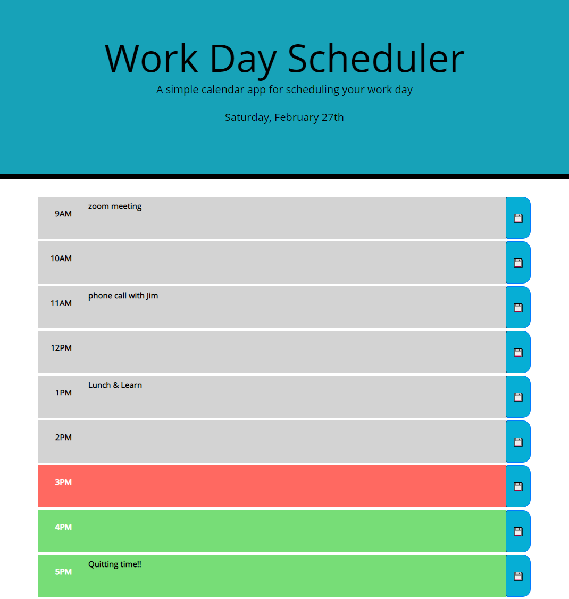

# Work-Day-Scheduler
This website is designed to allow a user to keep track of their workday.  The user can see what hours have passed, what the current hour is, what is coming up.  Users can enter events into each hour and they are saved even when the window is refreshed.

## Motivation
My motivation for this website was to create a schedule to allow users to better maximize their days.  The color coding allows a user to easily see what hour it is and what is coming up.   

### Image of my website

 

### Website Address

Visit my [Website](https://joshwalters34.github.io/Work-Day-Scheduler/)

### Repository

View my [GitHub_Repository](https://github.com/joshwalters34/Work-Day-Scheduler)

### Technologies
HTML5, CSS3, Bootstrap, jquery, Javascript, Moment.js
